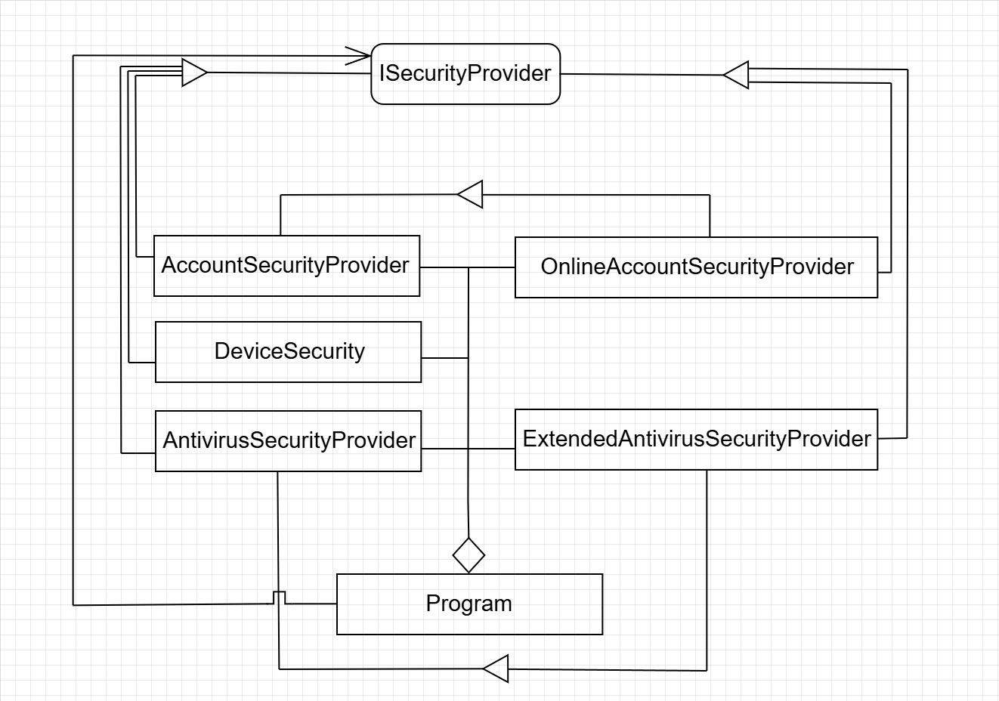

# Object Oriented Programming Demo

## Directory Structure

- The *Security* folder contains the code implementing various security providers.
- The *Communicators* folder contains the code simulating various communication providers. The .NET folder contains the ```c#``` implementation and the java folder for the ```java``` project.
- The *Diagram* folder includes class dependencies for each of the setup (Security and Communicators).

## Class Diagrams

### Communicator 
#### Initial Implementation


#### Communicator Factory Implementation


### Security
#### Initial Implementation

